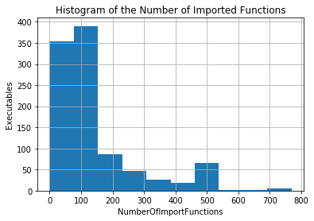
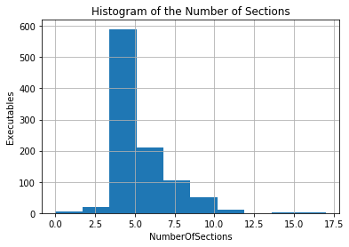
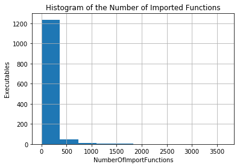
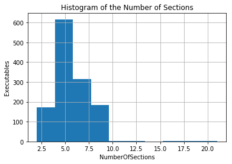
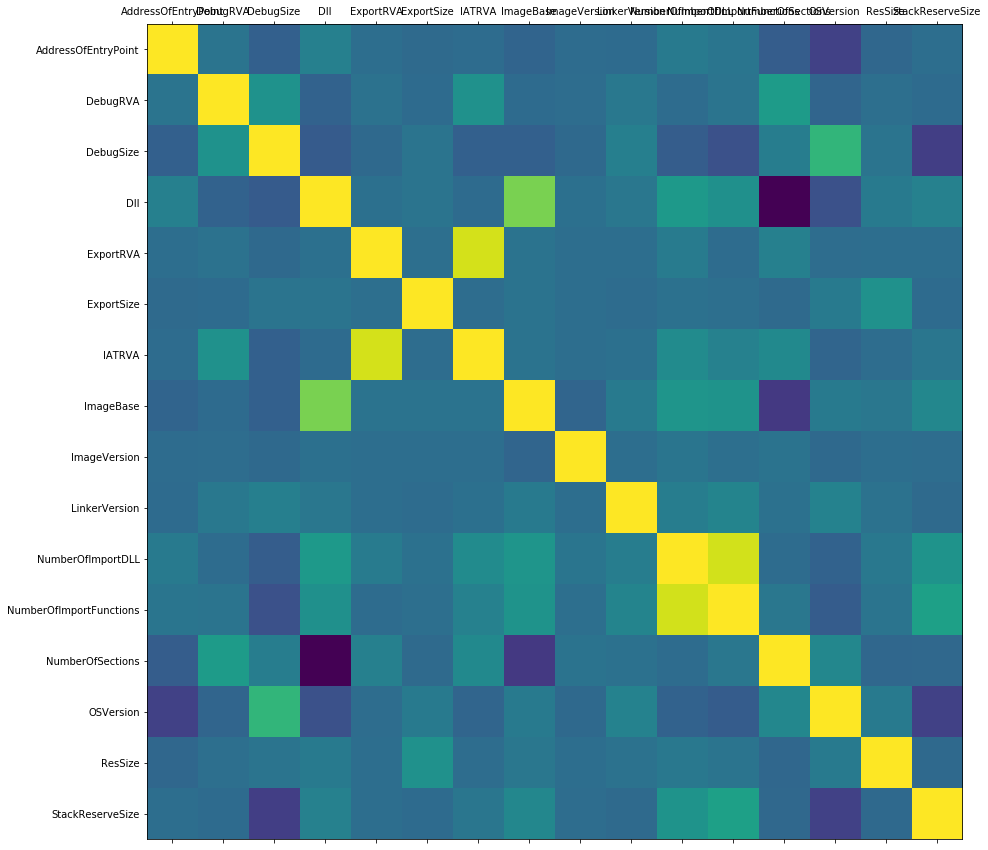
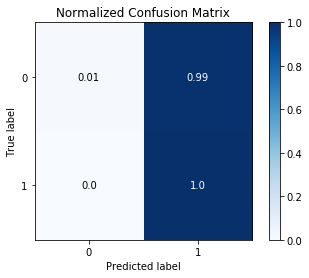
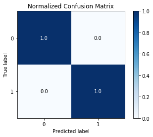
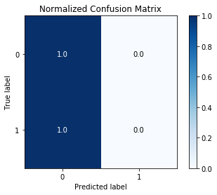
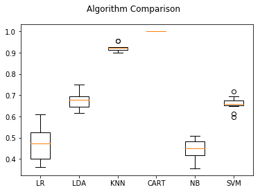

# Machine Learning Malware Detection 

### Machine Learning Workflow
    * Asking the right questions
    * Preparing the data
    * Selecting the algorithm
    * Training the model
    * Testing the model
    


## Why are we even interested in Machine Learning?

#### *Because Machine Learning is Sexy and you get to work with models!*


## Asking the right question..., 
Is a PE file Malware or Not Malware?  
*Hotdog or Not Hotdog?*


### Solution Statement:
Attempt to use the machine learning workflow to process and transform sampled PE file data to create a prediction model. Using the generated data, predict with 65% accuracy which PE files are likely to be classified as malware.


*http://resources.infosecinstitute.com/machine-learning-malware-detection/*

*https://app.pluralsight.com/library/courses/python-understanding-machine-learning/exercise-files*

*http://2012.infosecsouthwest.com/files/speaker_materials/ISSW2012_Selecting_Features_to_Classify_Malware.pdf*

Based off of the research "Selecting Features to Classify Malware", we are interested in extracting the following fields of a PE File:

* *Major Image Version: Used to indicate the major version number of the application; in Microsoft Excel version 4.0, it would be 4.*

* *Virtual Adress and Size of the IMAGE_DATA_DIRECTORY*

* *OS Version* (may not give much)

* *Import Adress Table Adress*

* *Ressources Size*

* *Number Of Sections* (we should look into section names)

* *Linker Version* (may not give much)

* *Size of Stack Reserve*

* *DLL Characteristics*

* *Export Table Size and Adress*

* *Address of Entry Point*

* *Image Base*

* *Number Of Import DLL* 	

* *Number Of Import Functions* 	

* *Number Of Sections*

Included in the dataset but not used: 
    
    DLL name and Imported Symbols (we might be able to create a weighted score to use with this info?)
                        
    filename

Stuff to include:
    DebugSize
    DebugRVA
    ImageVersion
    OperatingSystemVersion
    SizeOfStackReserve
    LinkerVersion
    DllCharacteristics
    IatRVA
    ExportSize
    ExportRVA
    ExportNameLen
    ResourceSize
    ExportFunctionsCount


#### Import all the needed libraries

    Pandas - provided data frames
    matplotlib.pyplot - plotting support


```python
import os
import pefile
import pprint as pp
import pandas as pd
import numpy as np
import matplotlib.pyplot as plt
import re
import csv
import glob
import magic
import hashlib
import sys
import struct
import peutils
from sklearn import model_selection
from sklearn.metrics import classification_report
from sklearn.metrics import confusion_matrix
from sklearn.metrics import accuracy_score
from sklearn.linear_model import LogisticRegression
from sklearn.tree import DecisionTreeClassifier
from sklearn.neighbors import KNeighborsClassifier
from sklearn.discriminant_analysis import LinearDiscriminantAnalysis
from sklearn.naive_bayes import GaussianNB
from sklearn.svm import SVC

```

To make our code more organized let’s start by creating a class that represents the PE File information as one object.
We are using the python module pefile which is a multi-platform Python module to parse and work with Portable Executable (aka PE) files. 
*https://github.com/erocarrera/pefile*


```python
def sha256_checksum(filename, block_size=65536):
    sha256 = hashlib.sha256()
    with open(filename, 'rb') as f:
        for block in iter(lambda: f.read(block_size), b''):
            sha256.update(block)
    return sha256.hexdigest()


```


```python
class PEFile:
    """ 
    This Class is constructed by parsing the pe file for the interesting features
    each pe file is an object by itself and we extract the needed information
    into a dictionary
    """
    # look to add PEid signatures to detect packers 
    # https://github.com/erocarrera/pefile/blob/wiki/PEiDSignatures.md
    # signatures = peutils.SignatureDatabase('./userdb.txt')    
    
    def __init__(self, filename):

        self.pe = pefile.PE(filename, fast_load=True)
        
        self.filename = filename      
        self.DebugSize = self.pe.OPTIONAL_HEADER.DATA_DIRECTORY[6].Size
        self.DebugRVA = self.pe.OPTIONAL_HEADER.DATA_DIRECTORY[6].VirtualAddress
        self.ImageVersion = self.pe.OPTIONAL_HEADER.MajorImageVersion
        self.OSVersion = self.pe.OPTIONAL_HEADER.MajorOperatingSystemVersion
        self.ExportRVA = self.pe.OPTIONAL_HEADER.DATA_DIRECTORY[0].VirtualAddress
        self.ExportSize = self.pe.OPTIONAL_HEADER.DATA_DIRECTORY[0].Size
        self.IATRVA = self.pe.OPTIONAL_HEADER.DATA_DIRECTORY[12].VirtualAddress
        self.ResSize = self.pe.OPTIONAL_HEADER.DATA_DIRECTORY[2].Size
        self.LinkerVersion = self.pe.OPTIONAL_HEADER.MajorLinkerVersion
        self.NumberOfSections = self.pe.FILE_HEADER.NumberOfSections
        self.StackReserveSize = self.pe.OPTIONAL_HEADER.SizeOfStackReserve
        self.Dll = self.pe.OPTIONAL_HEADER.DllCharacteristics
        self.AddressOfEntryPoint = self.pe.OPTIONAL_HEADER.AddressOfEntryPoint
        self.ImageBase = self.pe.OPTIONAL_HEADER.ImageBase
        
        # If the PE file was loaded using the fast_load=True argument, we will need to parse the data directories:
        self.pe.parse_data_directories()
        imported_dll = {}
        number_dll = 0
        try:
            for entry in self.pe.DIRECTORY_ENTRY_IMPORT:
                if entry is not None:
                #print(entry.dll)
                    number_dll += 1
                    for imp in entry.imports:
                        #print('\t', hex(imp.address), imp.name)
                        if imp.name is not None:
                            #print(imp.name.decode())
                            imported_dll[entry.dll.decode()] = imp.name.decode()
        except:
            pass#print("[-]")
                        
        self.ImportedDLL = imported_dll
        self.NumberOfImportDLL = number_dll
        
        section_names = {}
        number_sections = 0
        try:
            for section in self.pe.sections:
                number_sections += 1
                #print (section.Name, hex(section.VirtualAddress), hex(section.Misc_VirtualSize), section.SizeOfRawData )
                section_names[section.Name.decode()] = section.SizeOfRawData
            self.SectionNames = section_names
            self.NumberOfSections = number_sections
        except:
            pass#print("[-]")
            
        number_import_functions = 0
        import_function = []
        
        try:
            if self.pe.OPTIONAL_HEADER.DATA_DIRECTORY[pefile.DIRECTORY_ENTRY['IMAGE_DIRECTORY_ENTRY_IMPORT']].VirtualAddress != 0:
                self.pe.parse_data_directories(directories=[pefile.DIRECTORY_ENTRY['IMAGE_DIRECTORY_ENTRY_IMPORT']])
                for entry in self.pe.DIRECTORY_ENTRY_IMPORT:
                    for imp in entry.imports:
                        #print('\t', hex(imp.address), imp.name)
                        if imp.name:
                            number_import_functions += 1
                            import_function.append(imp.name.decode())
        except:
            pass#print("[-]")
            
        self.NumberOfImportFunctions = number_import_functions
        self.ImportedFunctions = import_function
        
    def Construct(self):
        sample = {}

        for attr, k in self.__dict__.items():
            if(attr != "pe"):
                sample[attr] = k
        return sample
    
    
```

Now we move on to write a small method that constructs a dictionnary for each PE File thus each sample will be represented as a python dictionnary where keys are the features and values are the value of each parsed field .


```python
def pe2vec(directory):
    """
    dirty function (handling all exceptions) for each sample
    it construct a dictionary of dictionaries in the format:
    sample x : pe informations
    """
    dataset = {}
    #directory = "./data/"
    print("")
    print("[*] Extracting the PE file data: ")
    print("")
    for subdir, dirs, files in os.walk(directory):
        for f in files:
            file_path = os.path.join(subdir, f)
            
            #print(magic.from_file(file_path))
            if re.match('^PE.*', magic.from_file(file_path)):
                try:
                    #print("[+] "+file_path)
                    pe = PEFile(file_path)
                    dataset[str(f)] = pe.Construct()
                except Exception as e:
                    raise
            else:
                #print()
                #print("[-] File not PE: "+file_path+" \n=>\t "+magic.from_file(file_path))
                #print()
                #print("Removing file.")
                os.remove(file_path)
    return dataset
    
    
```

### Testing the pe2vec() method and PEFile class

Print out the dataset for the Malware and Clean Samples


```python
for subdir, dirs, files in os.walk("./data/malware/"):
        for f in files:
            #print(f)
            os.rename("./data/malware/"+f, "./data/malware/"+sha256_checksum("./data/malware/"+f))
            
print("Done Renaming files to sha256")
```

    Done Renaming files to sha256


```python
# create a dataset dictionary from the collected PE file information
# we might consider adding an MD5 hash value and aappend it to a new column
# an asscoiated MD5 value could be used to lookup the VirusToltal score to confirm it is Malware if we did not get the sample from a good source
ds_malware = {}
ds_malware = pe2vec("./data/malware")
print("")
print("[*] Malware PE information:")
print("")
#pp.pprint(ds_malware)

print("")
print("[*] Completed Malware PE information extraction:")
print("")
```

    
    [*] Extracting the PE file data: 
    
    
    [*] Malware PE information:
    
    
    [*] Completed Malware PE information extraction:
    


```python
for subdir, dirs, files in os.walk("./data/clean/"):
        for f in files:
            #print(f)
            os.rename("./data/clean/"+f, "./data/clean/"+sha256_checksum("./data/clean/"+f))

print("Done Renaming files to sha256")
```

    Done Renaming files to sha256


```python
ds_clean = {}
ds_clean = pe2vec("./data/clean")
print("")
print("[*] Clean PE information:")
print("")
#pp.pprint(ds_clean)

print("")
print("[*] Completed Clean PE information extraction:")
print("")


```

    
    [*] Extracting the PE file data: 
    
    
    [*] Clean PE information:
    
    
    [*] Completed Clean PE information extraction:
    


Loop trough all samples in a folder and process each one of them then dump all those dictionaries into a csv file that we will use .


```python
# now that we have a dictionary let's put it in a clean csv file
def vec2csv(dataset, output_file):
    df = pd.DataFrame(dataset)
    test_data = df.transpose()  # transpose to have the features as columns and samples as rows
# utf-8 is prefered 
#output_file = './output/dataset.csv'
    test_data.to_csv(output_file,sep=',', encoding='utf-8')
    print("")
    print("[+] Saving file to: " + output_file)
    print("")
        
        
```

### Export the dataset as a csv file


```python
datasetOutput_malware = "./output/dataset_malware.csv"
vec2csv(ds_malware, datasetOutput_malware)

datasetOutput_clean = "./output/dataset_clean.csv"
vec2csv(ds_clean, datasetOutput_clean)


```

    
    [+] Saving file to: ./output/dataset_malware.csv
    
    
    [+] Saving file to: ./output/dataset_clean.csv
    


Use Magic %matplotlib to display graphics inline instead of in a popup window.


```python
%matplotlib inline


```

#### Malware Dataframe


```python
# get the dataframe
df_malware = pd.read_csv("./output/dataset_malware.csv")
df_malware.shape
df_malware.head(5)


```


<div>
<style scoped>
    .dataframe tbody tr th:only-of-type {
        vertical-align: middle;
    }

    .dataframe tbody tr th {
        vertical-align: top;
    }

    .dataframe thead th {
        text-align: right;
    }
</style>
<table border="1" class="dataframe">
  <thead>
    <tr style="text-align: right;">
      <th></th>
      <th>Unnamed: 0</th>
      <th>AddressOfEntryPoint</th>
      <th>DebugRVA</th>
      <th>DebugSize</th>
      <th>Dll</th>
      <th>ExportRVA</th>
      <th>ExportSize</th>
      <th>IATRVA</th>
      <th>ImageBase</th>
      <th>ImageVersion</th>
      <th>...</th>
      <th>ImportedFunctions</th>
      <th>LinkerVersion</th>
      <th>NumberOfImportDLL</th>
      <th>NumberOfImportFunctions</th>
      <th>NumberOfSections</th>
      <th>OSVersion</th>
      <th>ResSize</th>
      <th>SectionNames</th>
      <th>StackReserveSize</th>
      <th>filename</th>
    </tr>
  </thead>
  <tbody>
    <tr>
      <th>0</th>
      <td>0004cec68fdb95507c6161d84e4965db60f997a679ce20...</td>
      <td>1073962461</td>
      <td>0</td>
      <td>0</td>
      <td>32768</td>
      <td>0</td>
      <td>0</td>
      <td>155648</td>
      <td>4194304</td>
      <td>0</td>
      <td>...</td>
      <td>['GetPrivateProfileSectionW', 'CopyFileW', 'Se...</td>
      <td>8</td>
      <td>14</td>
      <td>253</td>
      <td>5</td>
      <td>4</td>
      <td>10856</td>
      <td>{'.text\x00\x00\x00': 148992, '.rdata\x00\x00'...</td>
      <td>1048576</td>
      <td>./data/malware/0004cec68fdb95507c6161d84e4965d...</td>
    </tr>
    <tr>
      <th>1</th>
      <td>0024eec62931670946abd4240d38127e23b4c0c9321de4...</td>
      <td>37296</td>
      <td>24720</td>
      <td>28</td>
      <td>0</td>
      <td>0</td>
      <td>0</td>
      <td>24576</td>
      <td>65536</td>
      <td>6</td>
      <td>...</td>
      <td>['StorPortPauseDevice', 'StorPortGetDeviceBase...</td>
      <td>9</td>
      <td>2</td>
      <td>16</td>
      <td>7</td>
      <td>6</td>
      <td>1536</td>
      <td>{'.text\x00\x00\x00': 18432, '.rdata\x00\x00':...</td>
      <td>262144</td>
      <td>./data/malware/0024eec62931670946abd4240d38127...</td>
    </tr>
    <tr>
      <th>2</th>
      <td>00a02d154e7389d3a5fe572e9800f1628e74b8aabe4270...</td>
      <td>1073916548</td>
      <td>0</td>
      <td>0</td>
      <td>32768</td>
      <td>0</td>
      <td>0</td>
      <td>114688</td>
      <td>5368709120</td>
      <td>0</td>
      <td>...</td>
      <td>['LoadBITMAP', 'LoadSTRINGW', 'LoadICON', 'Loa...</td>
      <td>9</td>
      <td>9</td>
      <td>179</td>
      <td>5</td>
      <td>5</td>
      <td>2552</td>
      <td>{'.text\x00\x00\x00': 107520, '.rdata\x00\x00'...</td>
      <td>1048576</td>
      <td>./data/malware/00a02d154e7389d3a5fe572e9800f16...</td>
    </tr>
    <tr>
      <th>3</th>
      <td>00aac566d9664b844e5d7ae641c58131ce59deced31223...</td>
      <td>51656</td>
      <td>5424</td>
      <td>28</td>
      <td>32832</td>
      <td>0</td>
      <td>0</td>
      <td>4096</td>
      <td>4294967296</td>
      <td>6</td>
      <td>...</td>
      <td>['OpenProcessToken', 'GetTokenInformation', 'R...</td>
      <td>9</td>
      <td>7</td>
      <td>151</td>
      <td>5</td>
      <td>6</td>
      <td>149376</td>
      <td>{'.text\x00\x00\x00': 55296, '.data\x00\x00\x0...</td>
      <td>524288</td>
      <td>./data/malware/00aac566d9664b844e5d7ae641c5813...</td>
    </tr>
    <tr>
      <th>4</th>
      <td>00cb557ec3c36d07f27e264dd6bffb6c858a3d9568878d...</td>
      <td>39104</td>
      <td>9360</td>
      <td>28</td>
      <td>32768</td>
      <td>0</td>
      <td>0</td>
      <td>8192</td>
      <td>4294967296</td>
      <td>5</td>
      <td>...</td>
      <td>[]</td>
      <td>8</td>
      <td>0</td>
      <td>0</td>
      <td>4</td>
      <td>5</td>
      <td>3492</td>
      <td>{'.text\x00\x00\x00': 57344, '.data\x00\x00\x0...</td>
      <td>524288</td>
      <td>./data/malware/00cb557ec3c36d07f27e264dd6bffb6...</td>
    </tr>
  </tbody>
</table>
<p>5 rows × 21 columns</p>
</div>


```python
# histograms
df_malware['NumberOfImportFunctions'].hist()
plt.title(r'Histogram of the Number of Imported Functions')
plt.xlabel('NumberOfImportFunctions')
plt.ylabel('Executables')
plt.show()
df_malware['NumberOfSections'].hist()
plt.title(r'Histogram of the Number of Sections')
plt.xlabel('NumberOfSections')
plt.ylabel('Executables')
plt.show()


```








#### Clean Dataframe


```python
df_clean = pd.read_csv("./output/dataset_clean.csv")
df_clean.shape
df_clean.head(5)


```


<div>
<style scoped>
    .dataframe tbody tr th:only-of-type {
        vertical-align: middle;
    }

    .dataframe tbody tr th {
        vertical-align: top;
    }

    .dataframe thead th {
        text-align: right;
    }
</style>
<table border="1" class="dataframe">
  <thead>
    <tr style="text-align: right;">
      <th></th>
      <th>Unnamed: 0</th>
      <th>AddressOfEntryPoint</th>
      <th>DebugRVA</th>
      <th>DebugSize</th>
      <th>Dll</th>
      <th>ExportRVA</th>
      <th>ExportSize</th>
      <th>IATRVA</th>
      <th>ImageBase</th>
      <th>ImageVersion</th>
      <th>...</th>
      <th>ImportedFunctions</th>
      <th>LinkerVersion</th>
      <th>NumberOfImportDLL</th>
      <th>NumberOfImportFunctions</th>
      <th>NumberOfSections</th>
      <th>OSVersion</th>
      <th>ResSize</th>
      <th>SectionNames</th>
      <th>StackReserveSize</th>
      <th>filename</th>
    </tr>
  </thead>
  <tbody>
    <tr>
      <th>0</th>
      <td>00070b0d4cb037c40d5d2464f92841aeb9ad863472bf95...</td>
      <td>21704</td>
      <td>4880</td>
      <td>28</td>
      <td>0</td>
      <td>0</td>
      <td>0</td>
      <td>4096</td>
      <td>4194304</td>
      <td>1</td>
      <td>...</td>
      <td>['__vbaVarTstGt', '__vbaVarSub', '__vbaStrI2',...</td>
      <td>6</td>
      <td>1</td>
      <td>139</td>
      <td>3</td>
      <td>4</td>
      <td>2184</td>
      <td>{'.text\x00\x00\x00': 1179648, '.data\x00\x00\...</td>
      <td>1048576</td>
      <td>./data/clean/00070b0d4cb037c40d5d2464f92841aeb...</td>
    </tr>
    <tr>
      <th>1</th>
      <td>00696555cbf6db83af785f8acb2270b9411cfc75e7f6d3...</td>
      <td>29424</td>
      <td>4256</td>
      <td>28</td>
      <td>49472</td>
      <td>32576</td>
      <td>163</td>
      <td>36864</td>
      <td>4194304</td>
      <td>6</td>
      <td>...</td>
      <td>['_except_handler4_common', '_controlfp', '?te...</td>
      <td>11</td>
      <td>21</td>
      <td>114</td>
      <td>6</td>
      <td>6</td>
      <td>2008</td>
      <td>{'.text\x00\x00\x00': 28672, '.data\x00\x00\x0...</td>
      <td>262144</td>
      <td>./data/clean/00696555cbf6db83af785f8acb2270b94...</td>
    </tr>
    <tr>
      <th>2</th>
      <td>007247436f041ca59c5ee0e8636c668c2a43376aeb8cfa...</td>
      <td>227872</td>
      <td>82400</td>
      <td>84</td>
      <td>49472</td>
      <td>0</td>
      <td>0</td>
      <td>3522560</td>
      <td>4194304</td>
      <td>10</td>
      <td>...</td>
      <td>['CryptAcquireContextW', 'CryptCreateHash', 'C...</td>
      <td>12</td>
      <td>8</td>
      <td>157</td>
      <td>5</td>
      <td>6</td>
      <td>1892</td>
      <td>{'.text\x00\x00\x00': 246272, '.data\x00\x00\x...</td>
      <td>4194304</td>
      <td>./data/clean/007247436f041ca59c5ee0e8636c668c2...</td>
    </tr>
    <tr>
      <th>3</th>
      <td>007bdab757d03d94e60c9b1e3eec13b07562705c514992...</td>
      <td>10656</td>
      <td>4320</td>
      <td>28</td>
      <td>49472</td>
      <td>0</td>
      <td>0</td>
      <td>20480</td>
      <td>4194304</td>
      <td>6</td>
      <td>...</td>
      <td>['??3@YAXPAX@Z', '_controlfp', '?terminate@@YA...</td>
      <td>11</td>
      <td>12</td>
      <td>46</td>
      <td>5</td>
      <td>6</td>
      <td>15632</td>
      <td>{'.text\x00\x00\x00': 8704, '.data\x00\x00\x00...</td>
      <td>262144</td>
      <td>./data/clean/007bdab757d03d94e60c9b1e3eec13b07...</td>
    </tr>
    <tr>
      <th>4</th>
      <td>008fa2b9697f9a173e40572face100410e51975e34a5ce...</td>
      <td>152696</td>
      <td>4224</td>
      <td>28</td>
      <td>33120</td>
      <td>0</td>
      <td>0</td>
      <td>200704</td>
      <td>5368709120</td>
      <td>6</td>
      <td>...</td>
      <td>['GetFileType', 'GetExitCodeProcess', 'CreateP...</td>
      <td>11</td>
      <td>7</td>
      <td>144</td>
      <td>6</td>
      <td>6</td>
      <td>28384</td>
      <td>{'.text\x00\x00\x00': 181248, '.data\x00\x00\x...</td>
      <td>524288</td>
      <td>./data/clean/008fa2b9697f9a173e40572face100410...</td>
    </tr>
  </tbody>
</table>
<p>5 rows × 21 columns</p>
</div>


```python
# histograms
df_clean['NumberOfImportFunctions'].hist()
plt.title(r'Histogram of the Number of Imported Functions')
plt.xlabel('NumberOfImportFunctions')
plt.ylabel('Executables')
plt.show()
df_clean['NumberOfSections'].hist()
plt.title(r'Histogram of the Number of Sections')
plt.xlabel('NumberOfSections')
plt.ylabel('Executables')
plt.show()


```








## Check the correlation
Helper function that displays correlation by color. Red is most correlated, Blue least.


```python
def plot_corr(df, size=15):
    """
    Function plots a graphical correlation matrix for each pair of columns in the dataframe.

    Input:
        df: pandas DataFrame
        size: vertical and horizontal size of the plot

    Displays:
        matrix of correlation between columns.  Blue-cyan-yellow-red-darkred => less to more correlated
                                                0 ------------------>  1
                                                Expect a darkred line running from top left to bottom right
    """

    corr = df.corr()    # data frame correlation function
    fig, ax = plt.subplots(figsize=(size, size))
    ax.matshow(corr)   # color code the rectangles by correlation value
    plt.xticks(range(len(corr.columns)), corr.columns)  # draw x tick marks
    plt.yticks(range(len(corr.columns)), corr.columns)  # draw y tick marks

    
```


```python
def correlation(dataset, threshold):
    col_corr = set() # Set of all the names of deleted columns
    corr_matrix = dataset.corr()
    for i in range(len(corr_matrix.columns)):
        for j in range(i):
            if corr_matrix.iloc[i, j] >= threshold:
                colname = corr_matrix.columns[i] # getting the name of column
                col_corr.add(colname)
                if colname in dataset.columns:
                    del dataset[colname] # deleting the column from the dataset

    print(dataset)
    
    
```

### Malware Correlation


```python
df_malware.corr()


```


<div>
<style scoped>
    .dataframe tbody tr th:only-of-type {
        vertical-align: middle;
    }

    .dataframe tbody tr th {
        vertical-align: top;
    }

    .dataframe thead th {
        text-align: right;
    }
</style>
<table border="1" class="dataframe">
  <thead>
    <tr style="text-align: right;">
      <th></th>
      <th>AddressOfEntryPoint</th>
      <th>DebugRVA</th>
      <th>DebugSize</th>
      <th>Dll</th>
      <th>ExportRVA</th>
      <th>ExportSize</th>
      <th>IATRVA</th>
      <th>ImageBase</th>
      <th>ImageVersion</th>
      <th>LinkerVersion</th>
      <th>NumberOfImportDLL</th>
      <th>NumberOfImportFunctions</th>
      <th>NumberOfSections</th>
      <th>OSVersion</th>
      <th>ResSize</th>
      <th>StackReserveSize</th>
    </tr>
  </thead>
  <tbody>
    <tr>
      <th>AddressOfEntryPoint</th>
      <td>1.000000</td>
      <td>0.035230</td>
      <td>-0.090583</td>
      <td>0.116372</td>
      <td>-0.005256</td>
      <td>-0.025972</td>
      <td>-0.013244</td>
      <td>-0.061953</td>
      <td>-0.015695</td>
      <td>-0.023625</td>
      <td>0.074893</td>
      <td>0.039400</td>
      <td>-0.106693</td>
      <td>-0.265357</td>
      <td>-0.048695</td>
      <td>-0.003774</td>
    </tr>
    <tr>
      <th>DebugRVA</th>
      <td>0.035230</td>
      <td>1.000000</td>
      <td>0.230066</td>
      <td>-0.077622</td>
      <td>0.019823</td>
      <td>-0.023057</td>
      <td>0.226593</td>
      <td>-0.023712</td>
      <td>-0.011859</td>
      <td>0.056641</td>
      <td>-0.018453</td>
      <td>0.035660</td>
      <td>0.290906</td>
      <td>-0.058632</td>
      <td>0.001549</td>
      <td>-0.023430</td>
    </tr>
    <tr>
      <th>DebugSize</th>
      <td>-0.090583</td>
      <td>0.230066</td>
      <td>1.000000</td>
      <td>-0.120497</td>
      <td>-0.032691</td>
      <td>0.031825</td>
      <td>-0.087493</td>
      <td>-0.086138</td>
      <td>-0.035535</td>
      <td>0.108552</td>
      <td>-0.109140</td>
      <td>-0.178110</td>
      <td>0.095590</td>
      <td>0.464331</td>
      <td>0.032082</td>
      <td>-0.277207</td>
    </tr>
    <tr>
      <th>Dll</th>
      <td>0.116372</td>
      <td>-0.077622</td>
      <td>-0.120497</td>
      <td>1.000000</td>
      <td>0.010906</td>
      <td>0.031482</td>
      <td>-0.022954</td>
      <td>0.682349</td>
      <td>0.006064</td>
      <td>0.054148</td>
      <td>0.276413</td>
      <td>0.216764</td>
      <td>-0.570699</td>
      <td>-0.182660</td>
      <td>0.071357</td>
      <td>0.122206</td>
    </tr>
    <tr>
      <th>ExportRVA</th>
      <td>-0.005256</td>
      <td>0.019823</td>
      <td>-0.032691</td>
      <td>0.010906</td>
      <td>1.000000</td>
      <td>0.001543</td>
      <td>0.897566</td>
      <td>0.027485</td>
      <td>-0.002995</td>
      <td>-0.000331</td>
      <td>0.080676</td>
      <td>-0.013044</td>
      <td>0.115386</td>
      <td>-0.011312</td>
      <td>-0.005866</td>
      <td>-0.004723</td>
    </tr>
    <tr>
      <th>ExportSize</th>
      <td>-0.025972</td>
      <td>-0.023057</td>
      <td>0.031825</td>
      <td>0.031482</td>
      <td>0.001543</td>
      <td>1.000000</td>
      <td>-0.012096</td>
      <td>0.024463</td>
      <td>-0.000733</td>
      <td>-0.012812</td>
      <td>0.013740</td>
      <td>0.002069</td>
      <td>-0.030079</td>
      <td>0.077484</td>
      <td>0.226113</td>
      <td>-0.023774</td>
    </tr>
    <tr>
      <th>IATRVA</th>
      <td>-0.013244</td>
      <td>0.226593</td>
      <td>-0.087493</td>
      <td>-0.022954</td>
      <td>0.897566</td>
      <td>-0.012096</td>
      <td>1.000000</td>
      <td>0.026367</td>
      <td>-0.002431</td>
      <td>0.011505</td>
      <td>0.184731</td>
      <td>0.119592</td>
      <td>0.177349</td>
      <td>-0.056255</td>
      <td>-0.006979</td>
      <td>0.043554</td>
    </tr>
    <tr>
      <th>ImageBase</th>
      <td>-0.061953</td>
      <td>-0.023712</td>
      <td>-0.086138</td>
      <td>0.682349</td>
      <td>0.027485</td>
      <td>0.024463</td>
      <td>0.026367</td>
      <td>1.000000</td>
      <td>-0.056380</td>
      <td>0.069552</td>
      <td>0.249721</td>
      <td>0.237441</td>
      <td>-0.311564</td>
      <td>0.075914</td>
      <td>0.049947</td>
      <td>0.157359</td>
    </tr>
    <tr>
      <th>ImageVersion</th>
      <td>-0.015695</td>
      <td>-0.011859</td>
      <td>-0.035535</td>
      <td>0.006064</td>
      <td>-0.002995</td>
      <td>-0.000733</td>
      <td>-0.002431</td>
      <td>-0.056380</td>
      <td>1.000000</td>
      <td>-0.003820</td>
      <td>0.039075</td>
      <td>0.002036</td>
      <td>0.028018</td>
      <td>-0.032553</td>
      <td>-0.003823</td>
      <td>-0.008052</td>
    </tr>
    <tr>
      <th>LinkerVersion</th>
      <td>-0.023625</td>
      <td>0.056641</td>
      <td>0.108552</td>
      <td>0.054148</td>
      <td>-0.000331</td>
      <td>-0.012812</td>
      <td>0.011505</td>
      <td>0.069552</td>
      <td>-0.003820</td>
      <td>1.000000</td>
      <td>0.095095</td>
      <td>0.139848</td>
      <td>0.017280</td>
      <td>0.127573</td>
      <td>0.021913</td>
      <td>-0.025194</td>
    </tr>
    <tr>
      <th>NumberOfImportDLL</th>
      <td>0.074893</td>
      <td>-0.018453</td>
      <td>-0.109140</td>
      <td>0.276413</td>
      <td>0.080676</td>
      <td>0.013740</td>
      <td>0.184731</td>
      <td>0.249721</td>
      <td>0.039075</td>
      <td>0.095095</td>
      <td>1.000000</td>
      <td>0.894713</td>
      <td>-0.012561</td>
      <td>-0.073946</td>
      <td>0.058651</td>
      <td>0.233540</td>
    </tr>
    <tr>
      <th>NumberOfImportFunctions</th>
      <td>0.039400</td>
      <td>0.035660</td>
      <td>-0.178110</td>
      <td>0.216764</td>
      <td>-0.013044</td>
      <td>0.002069</td>
      <td>0.119592</td>
      <td>0.237441</td>
      <td>0.002036</td>
      <td>0.139848</td>
      <td>0.894713</td>
      <td>1.000000</td>
      <td>0.055095</td>
      <td>-0.113983</td>
      <td>0.032964</td>
      <td>0.322661</td>
    </tr>
    <tr>
      <th>NumberOfSections</th>
      <td>-0.106693</td>
      <td>0.290906</td>
      <td>0.095590</td>
      <td>-0.570699</td>
      <td>0.115386</td>
      <td>-0.030079</td>
      <td>0.177349</td>
      <td>-0.311564</td>
      <td>0.028018</td>
      <td>0.017280</td>
      <td>-0.012561</td>
      <td>0.055095</td>
      <td>1.000000</td>
      <td>0.155466</td>
      <td>-0.045400</td>
      <td>-0.038067</td>
    </tr>
    <tr>
      <th>OSVersion</th>
      <td>-0.265357</td>
      <td>-0.058632</td>
      <td>0.464331</td>
      <td>-0.182660</td>
      <td>-0.011312</td>
      <td>0.077484</td>
      <td>-0.056255</td>
      <td>0.075914</td>
      <td>-0.032553</td>
      <td>0.127573</td>
      <td>-0.073946</td>
      <td>-0.113983</td>
      <td>0.155466</td>
      <td>1.000000</td>
      <td>0.069099</td>
      <td>-0.269090</td>
    </tr>
    <tr>
      <th>ResSize</th>
      <td>-0.048695</td>
      <td>0.001549</td>
      <td>0.032082</td>
      <td>0.071357</td>
      <td>-0.005866</td>
      <td>0.226113</td>
      <td>-0.006979</td>
      <td>0.049947</td>
      <td>-0.003823</td>
      <td>0.021913</td>
      <td>0.058651</td>
      <td>0.032964</td>
      <td>-0.045400</td>
      <td>0.069099</td>
      <td>1.000000</td>
      <td>-0.033629</td>
    </tr>
    <tr>
      <th>StackReserveSize</th>
      <td>-0.003774</td>
      <td>-0.023430</td>
      <td>-0.277207</td>
      <td>0.122206</td>
      <td>-0.004723</td>
      <td>-0.023774</td>
      <td>0.043554</td>
      <td>0.157359</td>
      <td>-0.008052</td>
      <td>-0.025194</td>
      <td>0.233540</td>
      <td>0.322661</td>
      <td>-0.038067</td>
      <td>-0.269090</td>
      <td>-0.033629</td>
      <td>1.000000</td>
    </tr>
  </tbody>
</table>
</div>


```python
plot_corr(df_malware)


```





```python
#correlation(df_malware, .99)


```


```python
#plot_corr(df_malware)


```

##### Malware dataframe with 0 values


```python
print("# rows in dataframe {0}".format(len(df_malware)))
print("# rows missing AddressOfEntryPoint: {0}".format(len(df_malware.loc[df_malware['AddressOfEntryPoint'] == 0])))
print("# rows missing DebugRVA: {0}".format(len(df_malware.loc[df_malware['DebugRVA'] == 0])))
print("# rows missing DebugSize: {0}".format(len(df_malware.loc[df_malware['DebugSize'] == 0])))
print("# rows missing Dll: {0}".format(len(df_malware.loc[df_malware['Dll'] == 0])))
print("# rows missing ExportRVA: {0}".format(len(df_malware.loc[df_malware['ExportRVA'] == 0])))
print("# rows missing ExportSize: {0}".format(len(df_malware.loc[df_malware['ExportSize'] == 0])))
print("# rows missing IATRVA: {0}".format(len(df_malware.loc[df_malware['IATRVA'] == 0])))
print("# rows missing ImageBase: {0}".format(len(df_malware.loc[df_malware['ImageBase'] == 0])))
print("# rows missing ImageVersion: {0}".format(len(df_malware.loc[df_malware['ImageVersion'] == 0])))
print("# rows missing LinkerVersion: {0}".format(len(df_malware.loc[df_malware['LinkerVersion'] == 0])))
print("# rows missing NumberOfSections: {0}".format(len(df_malware.loc[df_malware['NumberOfSections'] == 0])))
print("# rows missing OSVersion: {0}".format(len(df_malware.loc[df_malware['OSVersion'] == 0])))
print("# rows missing ResSize: {0}".format(len(df_malware.loc[df_malware['ResSize'] == 0])))
print("# rows missing StackReserveSize: {0}".format(len(df_malware.loc[df_malware['StackReserveSize'] == 0])))
print("# rows missing NumberOfImportDLL: {0}".format(len(df_malware.loc[df_malware['NumberOfImportDLL'] == 0])))
print("# rows missing NumberOfImportFunctions: {0}".format(len(df_malware.loc[df_malware['NumberOfImportFunctions'] == 0])))
print("# rows missing NumberOfSections: {0}".format(len(df_malware.loc[df_malware['NumberOfSections'] == 0])))


```

    # rows in dataframe 995
    # rows missing AddressOfEntryPoint: 3
    # rows missing DebugRVA: 267
    # rows missing DebugSize: 267
    # rows missing Dll: 141
    # rows missing ExportRVA: 910
    # rows missing ExportSize: 910
    # rows missing IATRVA: 19
    # rows missing ImageBase: 0
    # rows missing ImageVersion: 478
    # rows missing LinkerVersion: 0
    # rows missing NumberOfSections: 6
    # rows missing OSVersion: 0
    # rows missing ResSize: 64
    # rows missing StackReserveSize: 0
    # rows missing NumberOfImportDLL: 147
    # rows missing NumberOfImportFunctions: 147
    # rows missing NumberOfSections: 6


### Clean Correlation


```python
df_clean.corr()


```


<div>
<style scoped>
    .dataframe tbody tr th:only-of-type {
        vertical-align: middle;
    }

    .dataframe tbody tr th {
        vertical-align: top;
    }

    .dataframe thead th {
        text-align: right;
    }
</style>
<table border="1" class="dataframe">
  <thead>
    <tr style="text-align: right;">
      <th></th>
      <th>AddressOfEntryPoint</th>
      <th>DebugRVA</th>
      <th>DebugSize</th>
      <th>Dll</th>
      <th>ExportRVA</th>
      <th>ExportSize</th>
      <th>IATRVA</th>
      <th>ImageBase</th>
      <th>ImageVersion</th>
      <th>LinkerVersion</th>
      <th>NumberOfImportDLL</th>
      <th>NumberOfImportFunctions</th>
      <th>NumberOfSections</th>
      <th>OSVersion</th>
      <th>ResSize</th>
      <th>StackReserveSize</th>
    </tr>
  </thead>
  <tbody>
    <tr>
      <th>AddressOfEntryPoint</th>
      <td>1.000000</td>
      <td>0.376455</td>
      <td>-0.001188</td>
      <td>-0.046729</td>
      <td>0.686100</td>
      <td>0.159009</td>
      <td>0.378447</td>
      <td>-0.017464</td>
      <td>0.048777</td>
      <td>0.082353</td>
      <td>0.120774</td>
      <td>0.195789</td>
      <td>-0.026106</td>
      <td>-0.013296</td>
      <td>0.130714</td>
      <td>0.085269</td>
    </tr>
    <tr>
      <th>DebugRVA</th>
      <td>0.376455</td>
      <td>1.000000</td>
      <td>0.235510</td>
      <td>-0.030202</td>
      <td>0.165931</td>
      <td>0.021710</td>
      <td>0.550086</td>
      <td>0.124848</td>
      <td>-0.018012</td>
      <td>0.158134</td>
      <td>0.069459</td>
      <td>0.363659</td>
      <td>-0.050907</td>
      <td>-0.039534</td>
      <td>0.032462</td>
      <td>0.068129</td>
    </tr>
    <tr>
      <th>DebugSize</th>
      <td>-0.001188</td>
      <td>0.235510</td>
      <td>1.000000</td>
      <td>0.386591</td>
      <td>-0.001758</td>
      <td>0.043174</td>
      <td>0.132536</td>
      <td>0.108120</td>
      <td>0.027022</td>
      <td>0.489312</td>
      <td>0.062968</td>
      <td>0.069459</td>
      <td>-0.175783</td>
      <td>0.499236</td>
      <td>0.047429</td>
      <td>-0.190557</td>
    </tr>
    <tr>
      <th>Dll</th>
      <td>-0.046729</td>
      <td>-0.030202</td>
      <td>0.386591</td>
      <td>1.000000</td>
      <td>-0.064785</td>
      <td>-0.050356</td>
      <td>-0.033908</td>
      <td>-0.014890</td>
      <td>0.049520</td>
      <td>0.326582</td>
      <td>0.250669</td>
      <td>-0.020009</td>
      <td>-0.000204</td>
      <td>0.537415</td>
      <td>-0.020063</td>
      <td>-0.354395</td>
    </tr>
    <tr>
      <th>ExportRVA</th>
      <td>0.686100</td>
      <td>0.165931</td>
      <td>-0.001758</td>
      <td>-0.064785</td>
      <td>1.000000</td>
      <td>0.334106</td>
      <td>0.347014</td>
      <td>-0.008358</td>
      <td>-0.007997</td>
      <td>0.011629</td>
      <td>0.083542</td>
      <td>0.192323</td>
      <td>0.090855</td>
      <td>-0.021997</td>
      <td>0.214102</td>
      <td>0.044172</td>
    </tr>
    <tr>
      <th>ExportSize</th>
      <td>0.159009</td>
      <td>0.021710</td>
      <td>0.043174</td>
      <td>-0.050356</td>
      <td>0.334106</td>
      <td>1.000000</td>
      <td>0.178111</td>
      <td>-0.006341</td>
      <td>-0.006171</td>
      <td>0.023095</td>
      <td>0.088044</td>
      <td>0.071586</td>
      <td>0.214809</td>
      <td>0.029201</td>
      <td>0.005778</td>
      <td>-0.008533</td>
    </tr>
    <tr>
      <th>IATRVA</th>
      <td>0.378447</td>
      <td>0.550086</td>
      <td>0.132536</td>
      <td>-0.033908</td>
      <td>0.347014</td>
      <td>0.178111</td>
      <td>1.000000</td>
      <td>-0.025444</td>
      <td>0.158022</td>
      <td>0.041628</td>
      <td>0.282145</td>
      <td>0.542615</td>
      <td>0.170300</td>
      <td>0.074932</td>
      <td>0.216881</td>
      <td>0.084239</td>
    </tr>
    <tr>
      <th>ImageBase</th>
      <td>-0.017464</td>
      <td>0.124848</td>
      <td>0.108120</td>
      <td>-0.014890</td>
      <td>-0.008358</td>
      <td>-0.006341</td>
      <td>-0.025444</td>
      <td>1.000000</td>
      <td>-0.005917</td>
      <td>0.031480</td>
      <td>-0.101067</td>
      <td>-0.064428</td>
      <td>-0.064906</td>
      <td>-0.007955</td>
      <td>-0.008473</td>
      <td>-0.085809</td>
    </tr>
    <tr>
      <th>ImageVersion</th>
      <td>0.048777</td>
      <td>-0.018012</td>
      <td>0.027022</td>
      <td>0.049520</td>
      <td>-0.007997</td>
      <td>-0.006171</td>
      <td>0.158022</td>
      <td>-0.005917</td>
      <td>1.000000</td>
      <td>0.028758</td>
      <td>0.137971</td>
      <td>-0.000887</td>
      <td>0.017238</td>
      <td>0.044935</td>
      <td>-0.007953</td>
      <td>-0.046360</td>
    </tr>
    <tr>
      <th>LinkerVersion</th>
      <td>0.082353</td>
      <td>0.158134</td>
      <td>0.489312</td>
      <td>0.326582</td>
      <td>0.011629</td>
      <td>0.023095</td>
      <td>0.041628</td>
      <td>0.031480</td>
      <td>0.028758</td>
      <td>1.000000</td>
      <td>-0.032442</td>
      <td>-0.016006</td>
      <td>-0.331794</td>
      <td>0.366225</td>
      <td>0.015706</td>
      <td>-0.160583</td>
    </tr>
    <tr>
      <th>NumberOfImportDLL</th>
      <td>0.120774</td>
      <td>0.069459</td>
      <td>0.062968</td>
      <td>0.250669</td>
      <td>0.083542</td>
      <td>0.088044</td>
      <td>0.282145</td>
      <td>-0.101067</td>
      <td>0.137971</td>
      <td>-0.032442</td>
      <td>1.000000</td>
      <td>0.481672</td>
      <td>0.334914</td>
      <td>0.195613</td>
      <td>0.026599</td>
      <td>-0.093554</td>
    </tr>
    <tr>
      <th>NumberOfImportFunctions</th>
      <td>0.195789</td>
      <td>0.363659</td>
      <td>0.069459</td>
      <td>-0.020009</td>
      <td>0.192323</td>
      <td>0.071586</td>
      <td>0.542615</td>
      <td>-0.064428</td>
      <td>-0.000887</td>
      <td>-0.016006</td>
      <td>0.481672</td>
      <td>1.000000</td>
      <td>0.168574</td>
      <td>0.060505</td>
      <td>0.085063</td>
      <td>0.061108</td>
    </tr>
    <tr>
      <th>NumberOfSections</th>
      <td>-0.026106</td>
      <td>-0.050907</td>
      <td>-0.175783</td>
      <td>-0.000204</td>
      <td>0.090855</td>
      <td>0.214809</td>
      <td>0.170300</td>
      <td>-0.064906</td>
      <td>0.017238</td>
      <td>-0.331794</td>
      <td>0.334914</td>
      <td>0.168574</td>
      <td>1.000000</td>
      <td>-0.086133</td>
      <td>-0.035504</td>
      <td>0.090988</td>
    </tr>
    <tr>
      <th>OSVersion</th>
      <td>-0.013296</td>
      <td>-0.039534</td>
      <td>0.499236</td>
      <td>0.537415</td>
      <td>-0.021997</td>
      <td>0.029201</td>
      <td>0.074932</td>
      <td>-0.007955</td>
      <td>0.044935</td>
      <td>0.366225</td>
      <td>0.195613</td>
      <td>0.060505</td>
      <td>-0.086133</td>
      <td>1.000000</td>
      <td>0.018603</td>
      <td>-0.326980</td>
    </tr>
    <tr>
      <th>ResSize</th>
      <td>0.130714</td>
      <td>0.032462</td>
      <td>0.047429</td>
      <td>-0.020063</td>
      <td>0.214102</td>
      <td>0.005778</td>
      <td>0.216881</td>
      <td>-0.008473</td>
      <td>-0.007953</td>
      <td>0.015706</td>
      <td>0.026599</td>
      <td>0.085063</td>
      <td>-0.035504</td>
      <td>0.018603</td>
      <td>1.000000</td>
      <td>0.010637</td>
    </tr>
    <tr>
      <th>StackReserveSize</th>
      <td>0.085269</td>
      <td>0.068129</td>
      <td>-0.190557</td>
      <td>-0.354395</td>
      <td>0.044172</td>
      <td>-0.008533</td>
      <td>0.084239</td>
      <td>-0.085809</td>
      <td>-0.046360</td>
      <td>-0.160583</td>
      <td>-0.093554</td>
      <td>0.061108</td>
      <td>0.090988</td>
      <td>-0.326980</td>
      <td>0.010637</td>
      <td>1.000000</td>
    </tr>
  </tbody>
</table>
</div>


```python
plot_corr(df_clean)


```


```python
#correlation(df_clean, 0.8)


```


```python
#plot_corr(df_clean)


```

##### Clean dataframe with 0 values


```python
print("# rows in dataframe {0}".format(len(df_clean)))
print("# rows missing AddressOfEntryPoint: {0}".format(len(df_clean.loc[df_clean['AddressOfEntryPoint'] == 0])))
print("# rows missing DebugRVA: {0}".format(len(df_clean.loc[df_clean['DebugRVA'] == 0])))
print("# rows missing DebugSize: {0}".format(len(df_clean.loc[df_clean['DebugSize'] == 0])))
print("# rows missing Dll: {0}".format(len(df_clean.loc[df_clean['Dll'] == 0])))
print("# rows missing ExportRVA: {0}".format(len(df_clean.loc[df_clean['ExportRVA'] == 0])))
print("# rows missing ExportSize: {0}".format(len(df_clean.loc[df_clean['ExportSize'] == 0])))
print("# rows missing IATRVA: {0}".format(len(df_clean.loc[df_clean['IATRVA'] == 0])))
print("# rows missing ImageBase: {0}".format(len(df_clean.loc[df_clean['ImageBase'] == 0])))
print("# rows missing ImageVersion: {0}".format(len(df_clean.loc[df_clean['ImageVersion'] == 0])))
print("# rows missing LinkerVersion: {0}".format(len(df_clean.loc[df_clean['LinkerVersion'] == 0])))
print("# rows missing NumberOfSections: {0}".format(len(df_clean.loc[df_clean['NumberOfSections'] == 0])))
print("# rows missing OSVersion: {0}".format(len(df_clean.loc[df_clean['OSVersion'] == 0])))
print("# rows missing ResSize: {0}".format(len(df_clean.loc[df_clean['ResSize'] == 0])))
print("# rows missing StackReserveSize: {0}".format(len(df_clean.loc[df_clean['StackReserveSize'] == 0])))
print("# rows missing NumberOfImportDLL: {0}".format(len(df_clean.loc[df_clean['NumberOfImportDLL'] == 0])))
print("# rows missing NumberOfImportFunctions: {0}".format(len(df_clean.loc[df_clean['NumberOfImportFunctions'] == 0])))
print("# rows missing NumberOfSections: {0}".format(len(df_clean.loc[df_clean['NumberOfSections'] == 0])))


```

    # rows in dataframe 1297
    # rows missing AddressOfEntryPoint: 25
    # rows missing DebugRVA: 387
    # rows missing DebugSize: 387
    # rows missing Dll: 90
    # rows missing ExportRVA: 1220
    # rows missing ExportSize: 1220
    # rows missing IATRVA: 114
    # rows missing ImageBase: 0
    # rows missing ImageVersion: 433
    # rows missing LinkerVersion: 0
    # rows missing NumberOfSections: 0
    # rows missing OSVersion: 3
    # rows missing ResSize: 45
    # rows missing StackReserveSize: 18
    # rows missing NumberOfImportDLL: 29
    # rows missing NumberOfImportFunctions: 29
    # rows missing NumberOfSections: 0


# Preparing the Data

Supervised machine learning is best understood as approximating a target function (f) that maps input variables (X) to an output variable (Y).

Y = f(X)

This characterization describes the range of classification and prediction problems and the machine algorithms that can be used to address them.

The cause of poor performance in machine learning is either overfitting or underfitting the data.


## Merge the Malware and Clean Datasets

We will add the two datasets together within a single csv file making a new column to indicate the sample is Malware or Clean.  This new column will be a boolean value of 0 = "Clean" and 1 = "Malware" value.


Create a new def to assist in adding a new column for the Malware status and the corresponding value.


```python
def appendCSV(inputfile, outputfile, newheader, newdata):
    """   
    Function to add a new columns, new header, and new data to a csv file.  
    This new "Malware" column will be a boolean value of 0 = "Clean" and 1 = "Malware" value.
    
    Input:
        inputfile: "./output/dataset_malware.csv"
        outputfile: "./dataset/dataset_malware.csv"
        newheader: "Malware"
        newdata: 1
        
    Example:
        appendCSV("./output/dataset_malware.csv", "./dataset/dataset_malware.csv", "Malware", 1)
    """
    csv.field_size_limit(100000000)
    reader = csv.reader(open(inputfile, "r"))
    writer = csv.writer(open(outputfile, "w"))
    headers = next(reader)
    headers.append(newheader)
    writer.writerow(headers)
    for row in reader:
        row.append(newdata)
        writer.writerow(row)
        
        
```

Append the CSV files to mark the datasets as Malware or Clean


```python
appendCSV("./output/dataset_malware.csv", "./dataset/dataset_malware.csv", "Malware", 1)
appendCSV("./output/dataset_clean.csv", "./dataset/dataset_clean.csv", "Malware", 0)


```

Merge the Clean dataset and Malware dataset into one CSV file

We should also look into removing duplictaes and randomizing the order of samples in the dataset.


```python
interesting_files = glob.glob("./dataset/dataset_*.csv") 

header_saved = False
with open("./dataset/merged_output.csv","w") as fout:
    for filename in interesting_files:
        with open(filename) as fin:
            header = next(fin)
            if not header_saved:
                fout.write(header)
                header_saved = True
            for line in fin:
                fout.write(line)


```

### Loading and Reviewing the Merged Data


```python
merged_df = pd.read_csv("./dataset/merged_output.csv")


```

We dont need the Columns "ImportedSymbols" and "filename" for now so we will just drop them from the dataframe.


```python
try:
    del merged_df['ImportedSymbols']
    del merged_df['filename']
    del merged_df['SectionNames']
    del merged_df['ImportedFunctions']
except:
    print("")
    print("[*] Columns removed")
    print("")

```

    
    [*] Columns removed
    


```python
merged_df.shape


```


    (2292, 22)


```python
merged_df.describe()
```


<div>
<style scoped>
    .dataframe tbody tr th:only-of-type {
        vertical-align: middle;
    }

    .dataframe tbody tr th {
        vertical-align: top;
    }

    .dataframe thead th {
        text-align: right;
    }
</style>
<table border="1" class="dataframe">
  <thead>
    <tr style="text-align: right;">
      <th></th>
      <th>AddressOfEntryPoint</th>
      <th>DebugRVA</th>
      <th>DebugSize</th>
      <th>Dll</th>
      <th>ExportRVA</th>
      <th>ExportSize</th>
      <th>IATRVA</th>
      <th>ImageBase</th>
      <th>ImageVersion</th>
      <th>LinkerVersion</th>
      <th>NumberOfImportDLL</th>
      <th>NumberOfImportFunctions</th>
      <th>NumberOfSections</th>
      <th>OSVersion</th>
      <th>ResSize</th>
      <th>StackReserveSize</th>
      <th>Malware</th>
    </tr>
  </thead>
  <tbody>
    <tr>
      <th>count</th>
      <td>2.292000e+03</td>
      <td>2.292000e+03</td>
      <td>2292.000000</td>
      <td>2292.000000</td>
      <td>2.292000e+03</td>
      <td>2.292000e+03</td>
      <td>2.292000e+03</td>
      <td>2.292000e+03</td>
      <td>2292.000000</td>
      <td>2292.000000</td>
      <td>2292.000000</td>
      <td>2292.000000</td>
      <td>2292.000000</td>
      <td>2292.00000</td>
      <td>2.292000e+03</td>
      <td>2.292000e+03</td>
      <td>2292.000000</td>
    </tr>
    <tr>
      <th>mean</th>
      <td>6.568424e+07</td>
      <td>1.244702e+05</td>
      <td>23.396597</td>
      <td>32417.284468</td>
      <td>7.907806e+04</td>
      <td>3.421876e+04</td>
      <td>2.149736e+05</td>
      <td>2.611155e+10</td>
      <td>70.522251</td>
      <td>9.008290</td>
      <td>7.639616</td>
      <td>143.489965</td>
      <td>5.535777</td>
      <td>5.18630</td>
      <td>1.236307e+06</td>
      <td>9.154542e+05</td>
      <td>0.434119</td>
    </tr>
    <tr>
      <th>std</th>
      <td>3.082750e+08</td>
      <td>4.572434e+05</td>
      <td>18.261576</td>
      <td>13518.295561</td>
      <td>1.006857e+06</td>
      <td>6.635917e+05</td>
      <td>1.023666e+06</td>
      <td>4.064159e+11</td>
      <td>1179.422404</td>
      <td>5.318443</td>
      <td>6.294335</td>
      <td>160.622470</td>
      <td>1.703473</td>
      <td>1.17953</td>
      <td>1.190246e+07</td>
      <td>1.334605e+06</td>
      <td>0.495749</td>
    </tr>
    <tr>
      <th>min</th>
      <td>0.000000e+00</td>
      <td>0.000000e+00</td>
      <td>0.000000</td>
      <td>0.000000</td>
      <td>0.000000e+00</td>
      <td>0.000000e+00</td>
      <td>0.000000e+00</td>
      <td>6.553600e+04</td>
      <td>0.000000</td>
      <td>1.000000</td>
      <td>0.000000</td>
      <td>0.000000</td>
      <td>0.000000</td>
      <td>0.00000</td>
      <td>0.000000e+00</td>
      <td>0.000000e+00</td>
      <td>0.000000</td>
    </tr>
    <tr>
      <th>25%</th>
      <td>1.582400e+04</td>
      <td>0.000000e+00</td>
      <td>0.000000</td>
      <td>32768.000000</td>
      <td>0.000000e+00</td>
      <td>0.000000e+00</td>
      <td>8.192000e+03</td>
      <td>4.194304e+06</td>
      <td>0.000000</td>
      <td>8.000000</td>
      <td>3.000000</td>
      <td>65.000000</td>
      <td>5.000000</td>
      <td>5.00000</td>
      <td>1.992000e+03</td>
      <td>3.276800e+05</td>
      <td>0.000000</td>
    </tr>
    <tr>
      <th>50%</th>
      <td>5.000000e+04</td>
      <td>4.880000e+03</td>
      <td>28.000000</td>
      <td>33088.000000</td>
      <td>0.000000e+00</td>
      <td>0.000000e+00</td>
      <td>3.686400e+04</td>
      <td>4.194304e+06</td>
      <td>6.000000</td>
      <td>9.000000</td>
      <td>7.000000</td>
      <td>120.000000</td>
      <td>5.000000</td>
      <td>5.00000</td>
      <td>1.266400e+04</td>
      <td>1.048576e+06</td>
      <td>0.000000</td>
    </tr>
    <tr>
      <th>75%</th>
      <td>1.204425e+05</td>
      <td>4.264000e+04</td>
      <td>28.000000</td>
      <td>34112.000000</td>
      <td>0.000000e+00</td>
      <td>0.000000e+00</td>
      <td>1.351680e+05</td>
      <td>5.368709e+09</td>
      <td>6.000000</td>
      <td>11.000000</td>
      <td>10.000000</td>
      <td>158.000000</td>
      <td>6.000000</td>
      <td>6.00000</td>
      <td>1.327690e+05</td>
      <td>1.048576e+06</td>
      <td>1.000000</td>
    </tr>
    <tr>
      <th>max</th>
      <td>3.490505e+09</td>
      <td>9.103792e+06</td>
      <td>145.000000</td>
      <td>53568.000000</td>
      <td>3.993506e+07</td>
      <td>1.298409e+07</td>
      <td>3.993009e+07</td>
      <td>6.892871e+12</td>
      <td>21315.000000</td>
      <td>187.000000</td>
      <td>71.000000</td>
      <td>3659.000000</td>
      <td>21.000000</td>
      <td>10.00000</td>
      <td>3.391820e+08</td>
      <td>3.355443e+07</td>
      <td>1.000000</td>
    </tr>
  </tbody>
</table>
</div>


```python
merged_df.head(5)


```


<div>
<style scoped>
    .dataframe tbody tr th:only-of-type {
        vertical-align: middle;
    }

    .dataframe tbody tr th {
        vertical-align: top;
    }

    .dataframe thead th {
        text-align: right;
    }
</style>
<table border="1" class="dataframe">
  <thead>
    <tr style="text-align: right;">
      <th></th>
      <th>Unnamed: 0</th>
      <th>AddressOfEntryPoint</th>
      <th>DebugRVA</th>
      <th>DebugSize</th>
      <th>Dll</th>
      <th>ExportRVA</th>
      <th>ExportSize</th>
      <th>IATRVA</th>
      <th>ImageBase</th>
      <th>ImageVersion</th>
      <th>...</th>
      <th>LinkerVersion</th>
      <th>NumberOfImportDLL</th>
      <th>NumberOfImportFunctions</th>
      <th>NumberOfSections</th>
      <th>OSVersion</th>
      <th>ResSize</th>
      <th>SectionNames</th>
      <th>StackReserveSize</th>
      <th>filename</th>
      <th>Malware</th>
    </tr>
  </thead>
  <tbody>
    <tr>
      <th>0</th>
      <td>00070b0d4cb037c40d5d2464f92841aeb9ad863472bf95...</td>
      <td>21704</td>
      <td>4880</td>
      <td>28</td>
      <td>0</td>
      <td>0</td>
      <td>0</td>
      <td>4096</td>
      <td>4194304</td>
      <td>1</td>
      <td>...</td>
      <td>6</td>
      <td>1</td>
      <td>139</td>
      <td>3</td>
      <td>4</td>
      <td>2184</td>
      <td>{'.text\x00\x00\x00': 1179648, '.data\x00\x00\...</td>
      <td>1048576</td>
      <td>./data/clean/00070b0d4cb037c40d5d2464f92841aeb...</td>
      <td>0</td>
    </tr>
    <tr>
      <th>1</th>
      <td>00696555cbf6db83af785f8acb2270b9411cfc75e7f6d3...</td>
      <td>29424</td>
      <td>4256</td>
      <td>28</td>
      <td>49472</td>
      <td>32576</td>
      <td>163</td>
      <td>36864</td>
      <td>4194304</td>
      <td>6</td>
      <td>...</td>
      <td>11</td>
      <td>21</td>
      <td>114</td>
      <td>6</td>
      <td>6</td>
      <td>2008</td>
      <td>{'.text\x00\x00\x00': 28672, '.data\x00\x00\x0...</td>
      <td>262144</td>
      <td>./data/clean/00696555cbf6db83af785f8acb2270b94...</td>
      <td>0</td>
    </tr>
    <tr>
      <th>2</th>
      <td>007247436f041ca59c5ee0e8636c668c2a43376aeb8cfa...</td>
      <td>227872</td>
      <td>82400</td>
      <td>84</td>
      <td>49472</td>
      <td>0</td>
      <td>0</td>
      <td>3522560</td>
      <td>4194304</td>
      <td>10</td>
      <td>...</td>
      <td>12</td>
      <td>8</td>
      <td>157</td>
      <td>5</td>
      <td>6</td>
      <td>1892</td>
      <td>{'.text\x00\x00\x00': 246272, '.data\x00\x00\x...</td>
      <td>4194304</td>
      <td>./data/clean/007247436f041ca59c5ee0e8636c668c2...</td>
      <td>0</td>
    </tr>
    <tr>
      <th>3</th>
      <td>007bdab757d03d94e60c9b1e3eec13b07562705c514992...</td>
      <td>10656</td>
      <td>4320</td>
      <td>28</td>
      <td>49472</td>
      <td>0</td>
      <td>0</td>
      <td>20480</td>
      <td>4194304</td>
      <td>6</td>
      <td>...</td>
      <td>11</td>
      <td>12</td>
      <td>46</td>
      <td>5</td>
      <td>6</td>
      <td>15632</td>
      <td>{'.text\x00\x00\x00': 8704, '.data\x00\x00\x00...</td>
      <td>262144</td>
      <td>./data/clean/007bdab757d03d94e60c9b1e3eec13b07...</td>
      <td>0</td>
    </tr>
    <tr>
      <th>4</th>
      <td>008fa2b9697f9a173e40572face100410e51975e34a5ce...</td>
      <td>152696</td>
      <td>4224</td>
      <td>28</td>
      <td>33120</td>
      <td>0</td>
      <td>0</td>
      <td>200704</td>
      <td>5368709120</td>
      <td>6</td>
      <td>...</td>
      <td>11</td>
      <td>7</td>
      <td>144</td>
      <td>6</td>
      <td>6</td>
      <td>28384</td>
      <td>{'.text\x00\x00\x00': 181248, '.data\x00\x00\x...</td>
      <td>524288</td>
      <td>./data/clean/008fa2b9697f9a173e40572face100410...</td>
      <td>0</td>
    </tr>
  </tbody>
</table>
<p>5 rows × 22 columns</p>
</div>


```python
merged_df.tail(5)


```


<div>
<style scoped>
    .dataframe tbody tr th:only-of-type {
        vertical-align: middle;
    }

    .dataframe tbody tr th {
        vertical-align: top;
    }

    .dataframe thead th {
        text-align: right;
    }
</style>
<table border="1" class="dataframe">
  <thead>
    <tr style="text-align: right;">
      <th></th>
      <th>Unnamed: 0</th>
      <th>AddressOfEntryPoint</th>
      <th>DebugRVA</th>
      <th>DebugSize</th>
      <th>Dll</th>
      <th>ExportRVA</th>
      <th>ExportSize</th>
      <th>IATRVA</th>
      <th>ImageBase</th>
      <th>ImageVersion</th>
      <th>...</th>
      <th>LinkerVersion</th>
      <th>NumberOfImportDLL</th>
      <th>NumberOfImportFunctions</th>
      <th>NumberOfSections</th>
      <th>OSVersion</th>
      <th>ResSize</th>
      <th>SectionNames</th>
      <th>StackReserveSize</th>
      <th>filename</th>
      <th>Malware</th>
    </tr>
  </thead>
  <tbody>
    <tr>
      <th>2287</th>
      <td>fab80c8daa62c97bbb4cac1520a95c25b6cb755fbd1814...</td>
      <td>1074123741</td>
      <td>219760</td>
      <td>28</td>
      <td>32768</td>
      <td>0</td>
      <td>0</td>
      <td>217088</td>
      <td>5368709120</td>
      <td>0</td>
      <td>...</td>
      <td>8</td>
      <td>10</td>
      <td>288</td>
      <td>5</td>
      <td>4</td>
      <td>72860</td>
      <td>NaN</td>
      <td>1048576</td>
      <td>./data/malware/fab80c8daa62c97bbb4cac1520a95c2...</td>
      <td>1</td>
    </tr>
    <tr>
      <th>2288</th>
      <td>fd353ce31912ea745bf0b47144171a5700b128664711ad...</td>
      <td>6656</td>
      <td>8800</td>
      <td>28</td>
      <td>32768</td>
      <td>0</td>
      <td>0</td>
      <td>8192</td>
      <td>5368709120</td>
      <td>0</td>
      <td>...</td>
      <td>8</td>
      <td>4</td>
      <td>65</td>
      <td>5</td>
      <td>4</td>
      <td>48484</td>
      <td>{'.text\x00\x00\x00': 4096, '.rdata\x00\x00': ...</td>
      <td>1048576</td>
      <td>./data/malware/fd353ce31912ea745bf0b47144171a5...</td>
      <td>1</td>
    </tr>
    <tr>
      <th>2289</th>
      <td>fde7f22dcebcfbedafd5daecba1dc9952ff51c0ee43316...</td>
      <td>51656</td>
      <td>5424</td>
      <td>28</td>
      <td>32832</td>
      <td>0</td>
      <td>0</td>
      <td>4096</td>
      <td>4294967296</td>
      <td>6</td>
      <td>...</td>
      <td>9</td>
      <td>7</td>
      <td>151</td>
      <td>5</td>
      <td>6</td>
      <td>344936</td>
      <td>{'.text\x00\x00\x00': 55296, '.data\x00\x00\x0...</td>
      <td>524288</td>
      <td>./data/malware/fde7f22dcebcfbedafd5daecba1dc99...</td>
      <td>1</td>
    </tr>
    <tr>
      <th>2290</th>
      <td>fee18f402375b210fc7b89e29084fb8e478d5ee0f0cdb8...</td>
      <td>72752</td>
      <td>79760</td>
      <td>28</td>
      <td>32768</td>
      <td>0</td>
      <td>0</td>
      <td>77824</td>
      <td>5368709120</td>
      <td>0</td>
      <td>...</td>
      <td>8</td>
      <td>11</td>
      <td>216</td>
      <td>5</td>
      <td>4</td>
      <td>13264</td>
      <td>{'.text\x00\x00\x00': 70144, '.rdata\x00\x00':...</td>
      <td>1048576</td>
      <td>./data/malware/fee18f402375b210fc7b89e29084fb8...</td>
      <td>1</td>
    </tr>
    <tr>
      <th>2291</th>
      <td>fef17c9f848a3d291aa2070105bbbc143bb48ffd4c1fdf...</td>
      <td>51656</td>
      <td>5424</td>
      <td>28</td>
      <td>32832</td>
      <td>0</td>
      <td>0</td>
      <td>4096</td>
      <td>4294967296</td>
      <td>6</td>
      <td>...</td>
      <td>9</td>
      <td>7</td>
      <td>151</td>
      <td>5</td>
      <td>6</td>
      <td>412204</td>
      <td>{'.text\x00\x00\x00': 55296, '.data\x00\x00\x0...</td>
      <td>524288</td>
      <td>./data/malware/fef17c9f848a3d291aa2070105bbbc1...</td>
      <td>1</td>
    </tr>
  </tbody>
</table>
<p>5 rows × 22 columns</p>
</div>


#### Check For Null Values


```python
merged_df.isnull().values.any()


```


    True


### Check class distribution 

Rare events are hard to predict

Learning the parameters of a prediction function and testing it on the same data is a methodological mistake: a model that would just repeat the labels of the samples that it has just seen would have a perfect score but would fail to predict anything useful on yet-unseen data. This situation is called overfitting. To avoid it, it is common practice when performing a (supervised) machine learning experiment to hold out part of the available data as a test set X_test, y_test.


```python
num_obs = len(merged_df)
num_true = len(merged_df.loc[merged_df['Malware'] == 1])
num_false = len(merged_df.loc[merged_df['Malware'] == 0])

print("")
print("[*] Number of Malware files:  {0} ({1:2.2f}%)".format(num_true, (num_true/num_obs) * 100))
print("[*] Number of Clean files: {0} ({1:2.2f}%)".format(num_false, (num_false/num_obs) * 100))
print("")

```

    
    [*] Number of Malware files:  995 (43.41%)
    [*] Number of Clean files: 1297 (56.59%)
    


### Spliting the data 

70% for training, 30% for testing

We are using a simple split of our dataset but in the future we could use K-fold Cross Validation.  

Tuning the Hyperparameters with Cross Validation

    For each fold
        Determine the best hyperparameter value to tune
    Next
        Set the model hyperparameter value to the average best

The sklearn.cross_validation library assists in this process.

Algorithm CV Variants:
    Algorithm + Cross Validation = AlgorithmCV


```python
from sklearn.model_selection import train_test_split
from sklearn import datasets
from sklearn import svm

feature_col_names = ['AddressOfEntryPoint', 'DebugRVA', 'DebugSize', 'Dll', 'ExportRVA', 'ExportSize', 'IATRVA', 'ImageBase', 'ImageVersion', 'LinkerVersion', 'NumberOfSections', 'OSVersion', 'ResSize', 'StackReserveSize', 'Malware', "NumberOfImportDLL", "NumberOfImportFunctions", "NumberOfSections" ]
predicted_class_names = ['Malware']

X = merged_df[feature_col_names].values     # predictor feature columns 
y = merged_df[predicted_class_names].values # predicted class (1=true, 0=false) column 
split_test_size = 0.30

X_train, X_test, y_train, y_test = train_test_split(X, y, test_size=split_test_size, random_state=42) 
                            # test_size = 0.3 is 30%, 42 is the answer to everything
    
    
```

We check to ensure we have the the desired 70% train, 30% test split of the data


```python
print("")
print("[*] {0:0.2f}% in training set".format((len(X_train)/len(merged_df.index)) * 100))
print("[*] {0:0.2f}% in test set".format((len(X_test)/len(merged_df.index)) * 100))
print("")


```

    
    [*] 69.98% in training set
    [*] 30.02% in test set
    


#### Verifying predicted value was split correctly


```python
print("")
print("[*] Original Malware  : {0} ({1:0.2f}%)".format(len(merged_df.loc[merged_df['Malware'] == 1]), (len(merged_df.loc[merged_df['Malware'] == 1])/len(merged_df.index)) * 100.0))
print("[*] Original Clean : {0} ({1:0.2f}%)".format(len(merged_df.loc[merged_df['Malware'] == 0]), (len(merged_df.loc[merged_df['Malware'] == 0])/len(merged_df.index)) * 100.0))
print("")
print("[*] Training Malware  : {0} ({1:0.2f}%)".format(len(y_train[y_train[:] == 1]), (len(y_train[y_train[:] == 1])/len(y_train) * 100.0)))
print("[*] Training Clean : {0} ({1:0.2f}%)".format(len(y_train[y_train[:] == 0]), (len(y_train[y_train[:] == 0])/len(y_train) * 100.0)))
print("")
print("[*] Test Malware      : {0} ({1:0.2f}%)".format(len(y_test[y_test[:] == 1]), (len(y_test[y_test[:] == 1])/len(y_test) * 100.0)))
print("[*] Test Clean     : {0} ({1:0.2f}%)".format(len(y_test[y_test[:] == 0]), (len(y_test[y_test[:] == 0])/len(y_test) * 100.0)))
print("")

```

    
    [*] Original Malware  : 995 (43.41%)
    [*] Original Clean : 1297 (56.59%)
    
    [*] Training Malware  : 698 (43.52%)
    [*] Training Clean : 906 (56.48%)
    
    [*] Test Malware      : 297 (43.17%)
    [*] Test Clean     : 391 (56.83%)
    


#### Okay, I need to get some better Datasets...,

*https://github.com/urwithajit9/ClaMP*

*https://archive.ics.uci.edu/ml/datasets/Detect+Malacious+Executable(AntiVirus)*

*https://marcoramilli.blogspot.com/2016/12/malware-training-sets-machine-learning.html*

*https://github.com/jivoi/awesome-ml-for-cybersecurity#-datasets*

*https://github.com/ytisf/theZoo*

*https://zeltser.com/malware-sample-sources/*


# Selecting the Machine Learning Algorithm
*(Naive Bayes, Logisitic Regression, Decision Tree)*

We may need to test several algorithms with the dataset which we have generated.  
For our initial testing algorithm we have chosen the Gaussian Naive Bayes model which is based on likelihood and probability.  We have chosen this algorithm because it is fast, simple, and stable.

Algorithm decision factors:

    * Learning Type
        * Prediction Model => Supervised machine learning
    
    * Results (Regression vs Classification)
        * Classification (Malware vs Not Malware)
        
    * Complexity (Ensemble vs Simple)
        * Keep it Simple 
    
    * Basic vs Enhanced
        * Basic 


# Training the Model


##### Hidden missing values?

Are these 0 values possible?

How many rows have unexpected 0 values?

Common Problems with missing data, what options do we have?
    
    * Ignore the missing data values
    
    * Drop observation (rows) with missing data values
    
    * Replace missing data values (impute) 


#### Impute with the mean

*I have chosen not to imput missing data for initial testing*


```python
#from sklearn.preprocessing import Imputer

#Impute with mean all 0 readings
#fill_0 = Imputer(missing_values=0, strategy="mean", axis=0)

#X_train = fill_0.fit_transform(X_train)
#X_test = fill_0.fit_transform(X_test)


```

### Training Initial Algorithm - Naive Bayes

#### Scikit-learn library

Designed to work with NumPy, SciPy and Pandas

Toolset for training and evaluation tasks


```python
from sklearn.naive_bayes import GaussianNB

# create Gaussian Naive Bayes model object and train it with the data
nb_model = GaussianNB()

nb_model.fit(X_train, y_train.ravel())


```


    GaussianNB(priors=None)


# Testing the Accuracy


### Performance on Training Data


```python
# predict the values using the training data
nb_predict_train = nb_model.predict(X_train)

# import the performance metrics library
from sklearn import metrics

# Accuracy
print("Training Accuracy: {0:.4f}".format(metrics.accuracy_score(y_train, nb_predict_train)))
print()


```

    Training Accuracy: 0.4470
    


### Performance on Testing Data


```python
# predict the values using the testing data
nb_predict_test = nb_model.predict(X_test)

# Accuracy
print("Testing Accuracy: {0:.4f}".format(metrics.accuracy_score(y_test, nb_predict_test)))
print()


```

    Testing Accuracy: 0.4375
    


### Metrics - Confusion Matrix / Classification Report

    | TN | FP |
    | FN | TP |
    
Recall is the True Positive rate and indicates the probabilty of a true result.  
    
Recall = TP / (TP +FN ) (How well the model is predicting true Malware)

Precision = TP / (TP + FP) (Positive predictor value) 

True positives (TP)
The amount of labels, which were correctly identified by the classifier, that is assigned point labeled A to class A.

True negatives (TN)
The amount of labels, which were correctly rejected by the classifier, that is assigned point labeled A’ to class A’.

False positives (FP)
The amount of labels, which were incorrectly identified by the classifier, that is assigned point labeled A’ to class A.

False negatives (FN)
The amount of labels, which were incorrectly rejected by the classifier, that is assigned point labeled A to class A’.

Accuracy
Accuracy measures a fraction of the classifier’s predictions that are correct, that is the number of correct assessments divided by the number of all assessments – (TN + TP)/(TN + TP + FN + FP).

Precision (P)
Precision is the fraction of positive predictions that are correct – TP/(TP + FP). Be careful as classifier predicting only a single positive instance, that happens to be correct, will achieve perfect precision.

Recall (R)
Recall, sometimes called sensitivity in medical domains, measures the fraction of the truly positive instances. A score of 1 indicates, that no false negative were present – TP/(TP + FN). Be careful as classifier predicting positive for every example will achieve a recall of 1.

F1 score
Both precision and recall scores provide an incomplete view on the classifier performance and sometimes may provide skewed results. The F1 measure provides a better view by calculating weighted average of the scores – 2*P*R/(P + R). A model with perfect precision and recall scores will achieve an F1 score of one.


```python
print("Confusion Matrix")
print("{0}".format(metrics.confusion_matrix(y_test, nb_predict_test)))
print()

print("Classification Report")
print(metrics.classification_report(y_test, nb_predict_test))


```

    Confusion Matrix
    [[  5 386]
     [  1 296]]
    
    Classification Report
                 precision    recall  f1-score   support
    
              0       0.83      0.01      0.03       391
              1       0.43      1.00      0.60       297
    
    avg / total       0.66      0.44      0.28       688
    


```python
import scikitplot as skplt
skplt.metrics.plot_confusion_matrix(y_test, nb_predict_test, normalize=True)
plt.show()
```





## Random Forest


```python
#random forests
from sklearn.ensemble import RandomForestClassifier
rf_model = RandomForestClassifier(random_state=42)
rf_model.fit(X_train, y_train.ravel())


```


    RandomForestClassifier(bootstrap=True, class_weight=None, criterion='gini',
                max_depth=None, max_features='auto', max_leaf_nodes=None,
                min_impurity_decrease=0.0, min_impurity_split=None,
                min_samples_leaf=1, min_samples_split=2,
                min_weight_fraction_leaf=0.0, n_estimators=10, n_jobs=1,
                oob_score=False, random_state=42, verbose=0, warm_start=False)


### Performance on Training Data


```python
# predict the values using the training data
rf_predict_train = rf_model.predict(X_train)

# Accuracy
print("Training Accuracy: {0:.4f}".format(metrics.accuracy_score(y_train, rf_predict_train)))
print()


```

    Training Accuracy: 1.0000
    


### Performance on Testing Data


```python
# predict the values using the testing data
rf_predict_test = rf_model.predict(X_test)


# Accuracy
print("Testing Accuracy: {0:.4f}".format(metrics.accuracy_score(y_test, rf_predict_test)))
print()


```

    Testing Accuracy: 1.0000
    


```python
print("Confusion Matrix")
print("{0}".format(metrics.confusion_matrix(y_test, rf_predict_test)))
print()

print("Classification Report")
print(metrics.classification_report(y_test, rf_predict_test))


```

    Confusion Matrix
    [[391   0]
     [  0 297]]
    
    Classification Report
                 precision    recall  f1-score   support
    
              0       1.00      1.00      1.00       391
              1       1.00      1.00      1.00       297
    
    avg / total       1.00      1.00      1.00       688
    


```python
skplt.metrics.plot_confusion_matrix(y_test, rf_predict_test, normalize=True)
plt.show()


```





## Logistic Regression


```python
#logistic regression
from sklearn.linear_model import LogisticRegression
lr_model = LogisticRegression(C=0.7, random_state=42)
lr_model.fit(X_train, y_train.ravel())


```


    LogisticRegression(C=0.7, class_weight=None, dual=False, fit_intercept=True,
              intercept_scaling=1, max_iter=100, multi_class='ovr', n_jobs=1,
              penalty='l2', random_state=42, solver='liblinear', tol=0.0001,
              verbose=0, warm_start=False)


### Performance on Training Data


```python
# predict the values using the training data
lr_predict_train = lr_model.predict(X_train)

# Accuracy
print("Training Accuracy: {0:.4f}".format(metrics.accuracy_score(y_train, lr_predict_train)))
print()


```

    Training Accuracy: 0.3990
    


### Performance on Testing Data


```python
# predict the values using the testing data
lr_predict_test = lr_model.predict(X_test)


# Accuracy
print("Testing Accuracy: {0:.4f}".format(metrics.accuracy_score(y_test, lr_predict_test)))
print()


```

    Testing Accuracy: 0.4070
    


```python
print("Confusion Matrix")
print("{0}".format(metrics.confusion_matrix(y_test, lr_predict_test)))
print()

print("Classification Report")
print(metrics.classification_report(y_test, lr_predict_test))


```

    Confusion Matrix
    [[176 215]
     [193 104]]
    
    Classification Report
                 precision    recall  f1-score   support
    
              0       0.48      0.45      0.46       391
              1       0.33      0.35      0.34       297
    
    avg / total       0.41      0.41      0.41       688
    


```python
skplt.metrics.plot_confusion_matrix(y_test, lr_predict_test, normalize=True)
plt.show()


```


## Logistic RegressionCV


```python
#logistic regressioncv
from sklearn.linear_model import LogisticRegressionCV
lr_cv_model = LogisticRegressionCV(n_jobs=-1, Cs=3, cv=10, refit=False, class_weight="balanced", random_state=42)
lr_cv_model.fit(X_train, y_train.ravel())


```


    LogisticRegressionCV(Cs=3, class_weight='balanced', cv=10, dual=False,
               fit_intercept=True, intercept_scaling=1.0, max_iter=100,
               multi_class='ovr', n_jobs=-1, penalty='l2', random_state=42,
               refit=False, scoring=None, solver='lbfgs', tol=0.0001,
               verbose=0)


### Performance on Training Data


```python
# predict the values using the training data
lr_cv_predict_train = lr_cv_model.predict(X_train)

# Accuracy
print("Training Accuracy: {0:.4f}".format(metrics.accuracy_score(y_train, lr_cv_predict_train)))
print()


```

    Training Accuracy: 0.5648
    


### Performance on Testing Data


```python
# predict the values using the testing data
lr_cv_predict_test = lr_cv_model.predict(X_test)


# Accuracy
print("Testing Accuracy: {0:.4f}".format(metrics.accuracy_score(y_test, lr_cv_predict_test)))
print()


```

    Testing Accuracy: 0.5683
    


```python
print("Confusion Matrix")
print("{0}".format(metrics.confusion_matrix(y_test, lr_cv_predict_test)))
print()

print("Classification Report")
print(metrics.classification_report(y_test, lr_cv_predict_test))


```

    Confusion Matrix
    [[391   0]
     [297   0]]
    
    Classification Report
                 precision    recall  f1-score   support
    
              0       0.57      1.00      0.72       391
              1       0.00      0.00      0.00       297
    
    avg / total       0.32      0.57      0.41       688
    


    /Users/orlandobarreraii/anaconda3/lib/python3.6/site-packages/sklearn/metrics/classification.py:1135: UndefinedMetricWarning: Precision and F-score are ill-defined and being set to 0.0 in labels with no predicted samples.
      'precision', 'predicted', average, warn_for)


```python
skplt.metrics.plot_confusion_matrix(y_test, lr_cv_predict_test, normalize=True)
plt.show()


```





### Algorithm Comparison

We don’t know which algorithms would be good on this problem or what configurations to use. We get an idea from the plots that some of the classes are partially linearly separable in some dimensions, so we are expecting generally good results.

Let’s evaluate 6 different algorithms:

Logistic Regression (LR)
Linear Discriminant Analysis (LDA)
K-Nearest Neighbors (KNN).
Classification and Regression Trees (CART).
Gaussian Naive Bayes (NB).
Support Vector Machines (SVM).
This is a good mixture of simple linear (LR and LDA), nonlinear (KNN, CART, NB and SVM) algorithms. We reset the random number seed before each run to ensure that the evaluation of each algorithm is performed using exactly the same data splits. It ensures the results are directly comparable.


```python
import warnings
warnings.filterwarnings("ignore")
# Spot Check Algorithms
models = []
models.append(('LR', LogisticRegression()))
models.append(('LDA', LinearDiscriminantAnalysis()))
models.append(('KNN', KNeighborsClassifier()))
models.append(('CART', DecisionTreeClassifier()))
models.append(('NB', GaussianNB()))
models.append(('SVM', SVC()))
# evaluate each model in turn
results = []
names = []

for name, model in models:
    kfold = model_selection.KFold(n_splits=10, random_state=42)
    cv_results = model_selection.cross_val_score(model, X_train, y_train.ravel(), cv=kfold, scoring='accuracy')
    results.append(cv_results)
    names.append(name)
    msg = "%s: %f (%f)" % (name, cv_results.mean(), cv_results.std())
    print(msg)


# Compare Algorithms
fig = plt.figure()
fig.suptitle('Algorithm Comparison')
ax = fig.add_subplot(111)
plt.boxplot(results)
ax.set_xticklabels(names)
plt.show()


```

    LR: 0.472457 (0.075952)
    LDA: 0.672675 (0.038834)
    KNN: 0.923940 (0.018017)
    CART: 1.000000 (0.000000)
    NB: 0.446374 (0.045136)
    SVM: 0.658979 (0.033874)





